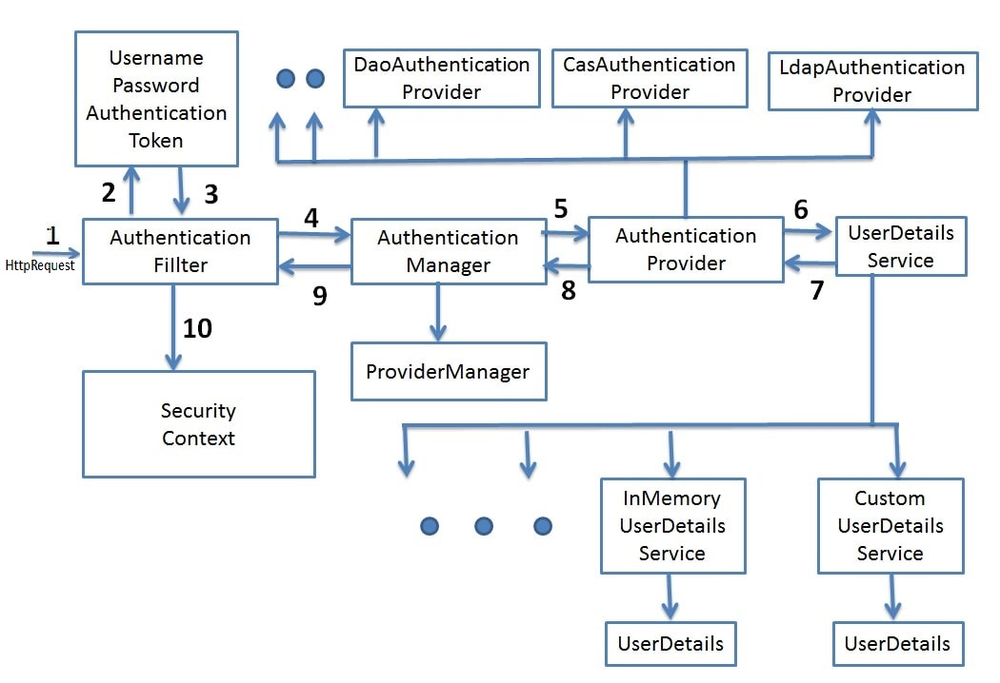
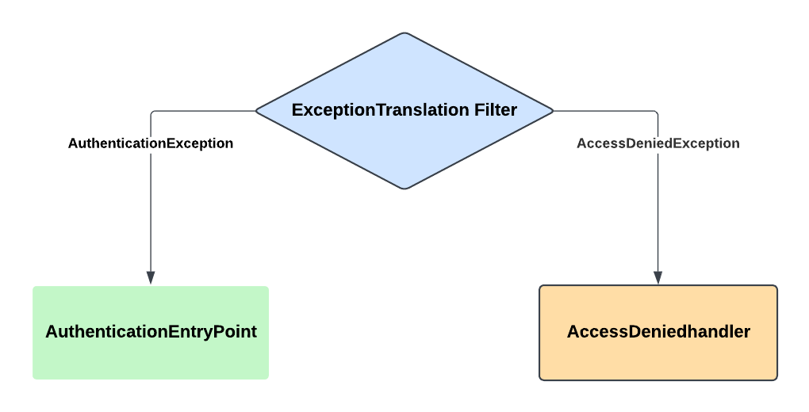

# SpringSecLab

A hands-on playground for exploring and experimenting with Spring Boot Security concepts. This project provides working examples covering authentication, authorization, JWT, method-level security, CSRF, CORS, custom filters, and event-driven logging.

---

# Spring Security Internal Flow


# Exception Handling in Spring Security


---

## Tech Stack

| Layer | Technology |
|-------|-----------|
| Framework | Spring Boot 3.3.3 |
| Language | Java 17 |
| Security | Spring Security 6 |
| Database | MySQL + Spring Data JPA |
| JWT | JJWT 0.12.5 |
| Build | Maven |

---

## Project Structure

```
src/main/java/com/learning/spring_security_learning/
├── Config/              # Security configuration (ProjectSecurityConfiguration)
├── Controllers/         # REST endpoints
├── Entities/            # JPA entities (Customer, CustomerRoles)
├── ExceptionHandlers/   # Custom AuthenticationEntryPoint & AccessDeniedHandler
├── Events/              # Authentication & authorization event listeners
├── Filters/             # JWT generator/validator, CSRF filter
├── Handlers/            # Form login success/failure handlers
├── Repository/          # JPA repositories
├── constants/           # Application constants
└── service/             # UserDetailsService, BankService
```

---

## API Endpoints

| Method | Path | Auth Required | Role / Permission |
|--------|------|:---:|---|
| GET | `/myBalance` | Yes | `ROLE_READ` |
| GET | `/myLoans` | Yes | `ROLE_ADMIN` |
| GET | `/myCards` | Yes | Authenticated |
| GET | `/myAccount` | Yes | Authenticated |
| GET | `/user` | Yes | Authenticated |
| POST | `/user` | No | Public |
| POST | `/apiLogin` | No | Public (returns JWT) |
| GET | `/contact` | No | Public |
| GET | `/notices` | No | Public |
| GET | `/invalidSession` | No | Public |

All paths not listed above are explicitly denied.

---

## Security Features

### Authentication

- **JWT** — stateless API authentication via `Authorization` header; tokens are generated on login (`/apiLogin`) and validated on subsequent requests
- **HTTP Basic** — enabled with a custom `AuthenticationEntryPoint` that returns JSON error responses
- **Form Login** — enabled with custom success/failure handlers that log events and return JSON

### Authorization

- **URL-based** — configured in `ProjectSecurityConfiguration` via `SecurityFilterChain`
- **Method-level** — enabled with `@EnableMethodSecurity`
  - `@PreAuthorize` — e.g., `hasRole('READ')` on `BankService`
  - `@PostAuthorize` — validates that returned data belongs to the authenticated user (e.g., `CustomerRepo.findByEmail`)
  - `@Secured` and JSR-250 (`@RolesAllowed`) also enabled

### Custom Filters

| Filter | Position | Purpose |
|--------|----------|---------|
| `JWTTokenValidatorFilter` | Before `BasicAuthenticationFilter` | Parses and validates JWT; populates `SecurityContext` |
| `JWTTokenGeneratorFilter` | After `BasicAuthenticationFilter` | Generates JWT after successful auth; adds to response header |
| `CustomCsrfFilter` | After `BasicAuthenticationFilter` | Ensures CSRF token is available for clients |

### CSRF

- Cookie-based CSRF tokens (`HttpOnly: false` so the JS client can read them)
- Disabled only for `/apiLogin`

### CORS

- Allowed origin: `http://localhost:4200`
- All methods allowed
- `Authorization` header exposed to clients
- Credentials enabled

### Password Security

- `DelegatingPasswordEncoder` (supports multiple algorithms)
- `HaveIBeenPwnedRestApiPasswordChecker` rejects compromised passwords at registration

### Session Management

- Policy: **STATELESS**
- Session timeout: 2 minutes
- Invalid session redirect: `/invalidSession`
- Session fixation protection: `changeSessionId`

---

## Event Listeners

- `ProjectAuthenticationEvents` — logs authentication success and failure
- `ProjectAuthorizationEvents` — logs authorization denials

---

## Exception Handling

| Exception | Handler | Response |
|-----------|---------|---------|
| `AuthenticationException` | `CustomAuthenticationEntryPoint` | 401 JSON with timestamp, path, message |
| `AccessDeniedException` | `CustomAccessDeniedException` | 403 JSON |

---

## Running the App

### Prerequisites

- Java 17+
- MySQL running on `localhost:3306`
- Database `springSecurityDB` created

### Default Profile

```bash
./mvnw spring-boot:run
```

### Local Profile (in-memory user `test/test`, verbose SQL logging)

```bash
./mvnw spring-boot:run -Dspring-boot.run.profiles=local
```

Server starts on port **9001**.

---

## Keystore & Certificate Commands

Generate a keystore and self-signed certificate for mTLS / HTTPS:

```bash
# Generate key pair
keytool -genkeypair \
  -keypass password@1234 -storepass password@1234 \
  -keystore serverkeystore \
  -alias youralias \
  -keyalg RSA -validity 365

# Export certificate
keytool -export \
  -alias youralias \
  -keystore serverkeystore \
  -storepass password@1234 \
  -rfc -file mycert.crt

# Import into truststore
keytool -import \
  -trustcacerts \
  -keystore servertruststore.p12 \
  -storetype PKCS12 \
  -storepass truststore@1234 \
  -alias client-cert \
  -file certificate.pem
```
