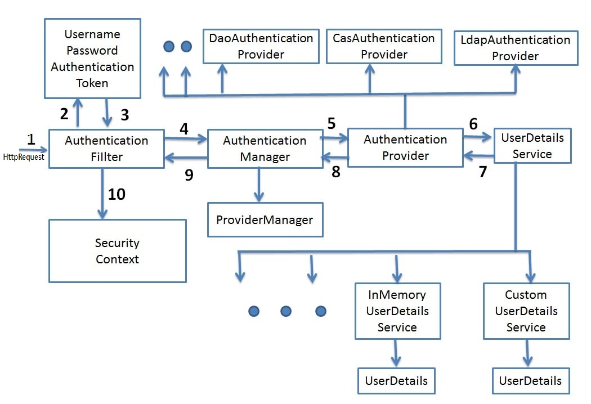

# SpringSecLab
SpringSecLab is a hands-on playground for exploring and experimenting with Spring Boot Security concepts. This project provides examples and demos covering core security features like authentication, authorization, role-based access control, JWT implementation, and OAuth2 integration.

