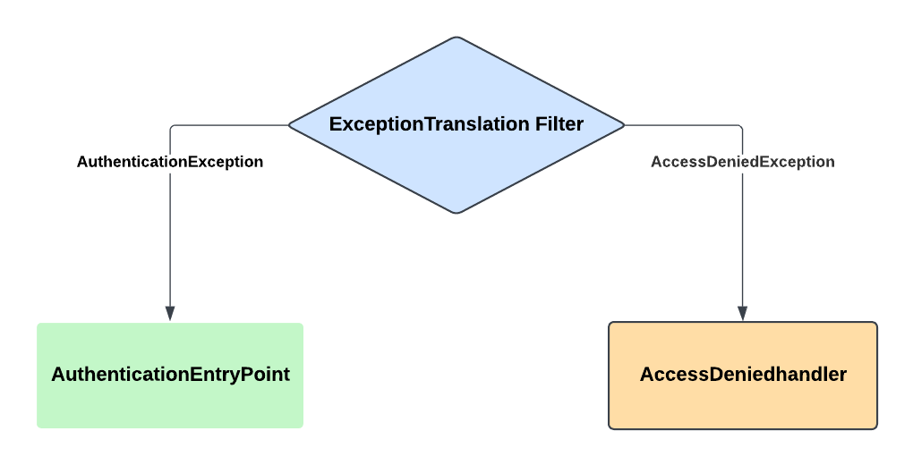

# SpringSecLab
SpringSecLab is a hands-on playground for exploring and experimenting with Spring Boot Security concepts. This project provides examples and demos covering core security features like authentication, authorization, role-based access control, JWT implementation, and OAuth2 integration.

# Spring Security Internal Flow

# Exception Handling Spring Security

# Commands to generate keystore and certificate

keytool -genkeypair -keypass password@1234 -storepass password@1234 -keystore serverkeystore -alias youralias -keyalg RSA -validity 365

keytool -export -alias youralias -keystore serverkeystore -storepass password@1234 -rfc -file mycert.crt

keytool -import -trustcacerts -keystore servertruststore.p12 -storetype PKCS12 -storepass truststore@1234 -alias client-cert -file certificate.pem
